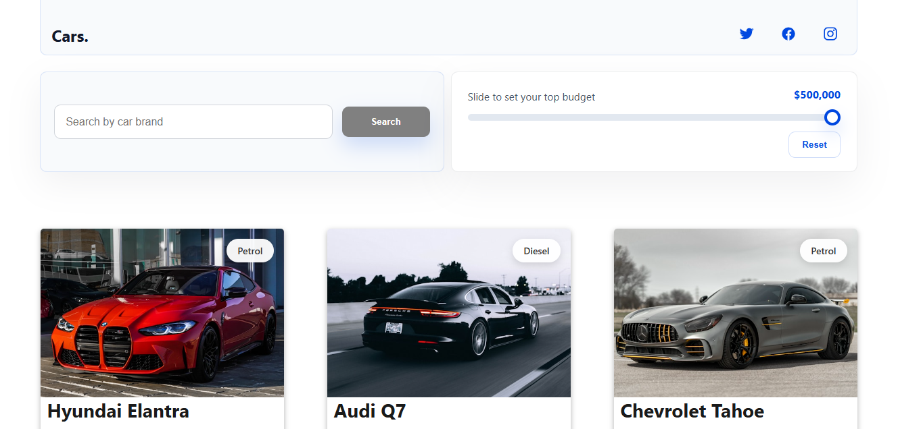
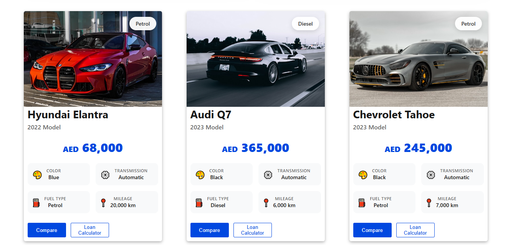

# 🚗 Cars For Sale

A modern car dealership interface built with React, featuring price comparison, a loan calculator, advanced search and filtering, and detailed vehicle pages. Focused on clean UI, smooth user experience, and scalable front-end architecture.

---

## 📸 Preview

| Home                        | cars                        |
| --------------------------- | --------------------------- |
|  |  |

| carCard  
| ---------------------------
| 

---

## 🚀 Features

- 🔍 Search cars by brand
- 💰 Filter cars by price range
- 🧮 Loan calculator for estimating monthly payments
- ⚖️ Compare cars side-by-side
- ⚡ Fast and responsive UI

---

## 🛠️ Built With

- React.js
- React Router
- JavaScript (ES6+)
- HTML
- CSS3
- Responsive design

---

## 📂 Project Structure

src/
├── components
├── pages
├── context
├── hooks
├── assets
├── styles
└── App.js

---

## 🌐 Live Demo

**Demo:** https://ahmdgoud.github.io/Cars-For-Sale/#/

---

## 👨‍💻 Author

**Ahmed AbdelRahman**

- Portfolio: https://ahmdgoud.github.io/AhmedAbdelRahman/
- LinkedIn: https://www.linkedin.com/in/ahmed-abdelrahman-7ab52b231/
